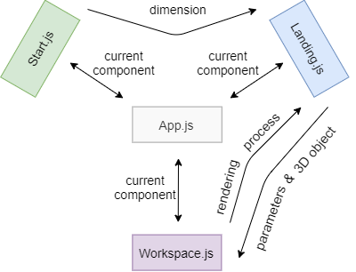

## Overview
We present a standalone application for 2.5D object tracking in industrial environments. We created an user interface for easier working with Blender-Gen for rendering and SSPE for training. The necessary user input is a basic parameter setting, as well us uploading of a 3D model and optionally a set of real images. The outcome is a model weight, ready to be used for the current use case. Our website automates the whole process, so that the user do not need technical background of how to start and bind every single process, but he or she simply needs to follow the basic instructions on the website and wait until everything is set up, ran and ready to be used.

**Attention:** This repository presents only the Frontend side of the whole web application. Please visit https://github.com/subhinlee/IAS-Project-Node/tree/master for the Node.js server and https://github.com/ignc-research/blender-ml-docker/tree/develop for the Backend side.

## Requirements
The application (the frontend side of the whole pipeline) can be run on every operating system. We recommend installing and using [VS Code](https://code.visualstudio.com/download). All of the necessary libraries will be automatically installed, when you follow the instructions in the 'How to run' section. That is why the first time you set it up it could take some time.

## How to run
1. Initialize the App
    ### `npm install`
    Should be executed every time the dependencies have been changed, as well as setting up the repository for the first time.
2. Run the App
    ### `npm start`
    The command runs the app in the development mode. It should be executed from the project directory. Open [http://localhost:3000](http://localhost:3000) to view it in the browser! The page will reload if you make edits. You can also see any warnings and errors in the console.

## How was it build

The web application represents the Frontend of the entire project. It was developed completely using React.js, which gives structure and enables an easy set up and easier future further development. Another big library Three.js was used for the 3D-Visualisation of the camera parameters, which makes the App even more interactive and user-friendly.

## Structure

The App consits of three components. Its modular design - all three components (Start.js, Landing.js and Workspace.js), as well as its connections, displaying the workflow in time, are visible in the following diagram. The separation in modules is just an internal separation for easier management, so the webpage is still hosted on only a single localhost.

  

## Internal communication between the components

Even though for the user it seems like a smooth workflow, all three components were developed entirely independent, which brought the necessity of passing arguments between each other. A diagram of the communication between all tree components could be seen in the following diagram. It is achieved through a combining element with the name App.js. Every one of the three components informs, respectively gets the information from App.js about the wanted current component. Start.js sends the dimension set from the user via App.js to Landing.js. Landing.js sends all parameters and the 3D object to the Workspace.js again via App.js. Still not everything should be passed from one component to the next. The real images are for example not passed, but directly send to the Backend via the Node.js server, because Workspace.js will visualize only the 3D model. Landing.js receives later on the rendering process from the Workspace via App.js. And the loops continues, if the user decides to start all over again.

  

