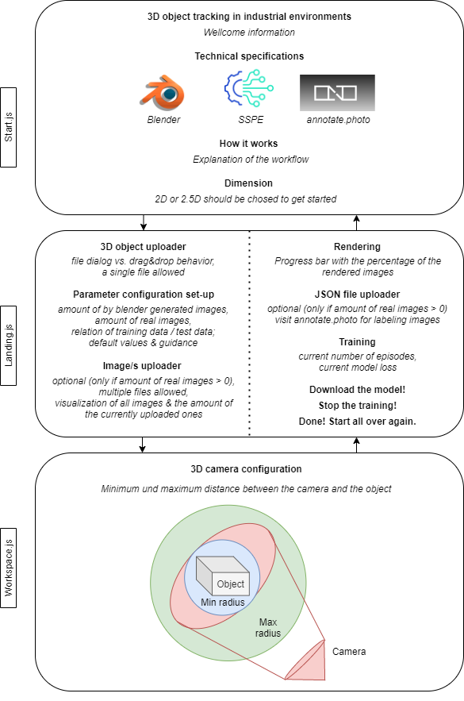

## Initialize the App
### `npm install`

## Run the App
### `npm start`

Runs the app in the development mode.\
Should be executed from the project directory.\
Open [http://localhost:3000](http://localhost:3000) to view it in the browser.

The page will reload if you make edits.\
You will also see any lint errors in the console.

## Structure of the App

The modular design of the webpage - all three components (Start.js, Landing.js and Workspace.js), as well as its connections, displaying the workflow in time, are visible in the following diagram.

  

